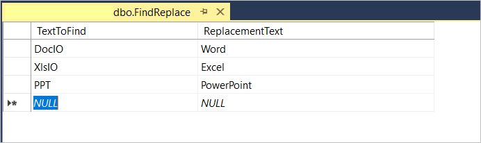

# How to replace text with data from database
This example shows how to find a text in a Word document and replace it with a text from the database.

# How to run this Sample

1. Download this project to a location in your disk.

2. Create table in database with columns "TextToFind" and "ReplacementText" as like the screenshot shown below.

3. Open the solution file using Visual Studio.

4. Add datasource and database values in Program.cs file

5. Rebuild the solution to install the required NuGet packages.

6. Run the application.